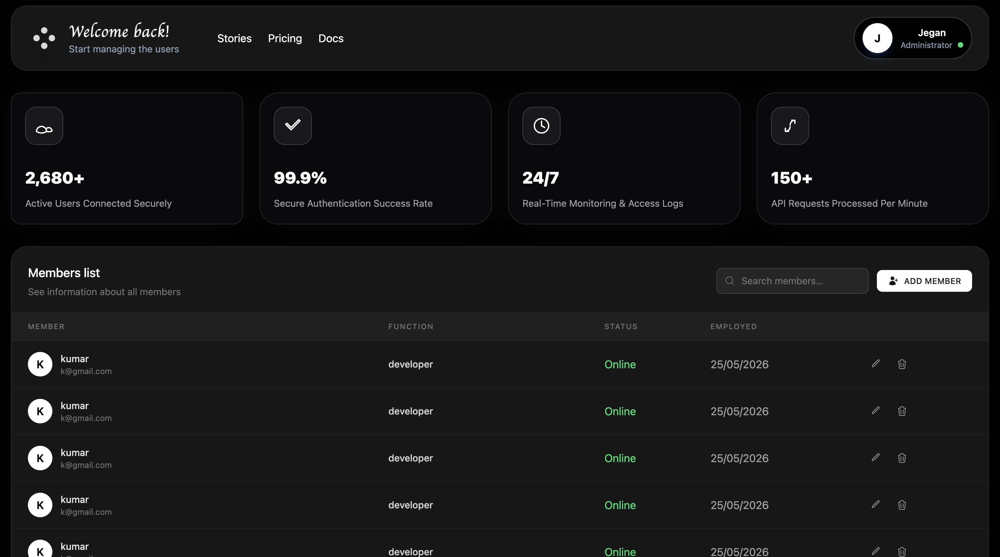

# Smart Member Management System

A modern full-stack Member Management application built using Angular, Node.js, Express.js, MongoDB, JWT Authentication, and Tailwind CSS.

The application allows administrators to securely manage users through a clean and responsive dashboard interface.

---

# 🚀 Features

- JWT Authentication
- Secure Admin Login
- Add User
- Edit User
- Delete User
- Protected API Routes
- Responsive Dashboard UI
- Search Users
- MongoDB Database Integration
- Modern TailwindCSS Design
- REST API Architecture

---

# 🛠️ Tech Stack

## Frontend
- Angular 17
- TypeScript
- Tailwind CSS
- Angular HTTP Client
- RxJS

## Backend
- Node.js
- Express.js
- MongoDB Atlas
- Mongoose
- JWT Authentication
- bcryptjs

---

# 📂 Project Structure

```bash
project-root/
│
├── 
├──  src/app/features/*
├──  angular.json
│
├── backend/
│   ├── server.js
│   └── package.json
│   
└── README.md
```

---

# 🔐 Authentication

The application uses JWT-based authentication.

### Flow
1. Admin logs in using email and password
2. Backend validates credentials
3. JWT token is generated
4. Token stored in localStorage
5. Protected routes accessed using Authorization headers

---

# 📸 Screenshots

## Dashboard




## Profile Modal


## Add User Modal


## Search Table


---

## Edit User


---


## Delete User


---


# ⚙️ Installation

## Clone Repository

```bash
git clone https://github.com/jeganath18/smart_user_manamgement.git
```

---

# Frontend Setup

```bash

npm install

ng serve
```

Frontend runs on:

```bash
http://localhost:4200
```

---

# Backend Setup

```bash
cd backend

npm install

node server.js
```

Backend runs on:

```bash
http://localhost:3000
```

---


# 📡 API Endpoints

## Authentication

| Method | Endpoint | Description |
|---|---|---|
| POST | `/login` | Admin Login |
| POST | `/create-user` | Create Admin |

---

## Users

| Method | Endpoint | Description |
|---|---|---|
| GET | `/members` | Get All Users |
| POST | `/members` | Add User |
| PUT | `/members/:id` | Edit User |
| DELETE | `/members/:id` | Delete User |

---

# 🎨 UI Features

- Responsive Design
- Modern Dark Theme
- TailwindCSS Styling
- Interactive User Table
- Modal-based CRUD Operations

---

# 🔒 Security Features

- Password Hashing using bcrypt
- JWT Token Verification
- Protected APIs
- Environment Variable Protection
- MongoDB Secure Connection

---

# 📈 Future Improvements

- Role-based Access Control
- Pagination
- User Activity Logs
- Export to Excel/PDF
- Email Notifications
- Profile Management

---

# 👨‍💻 Author

### Jeganath B

Full Stack Developer passionate about building scalable and modern web applications.

---

# ⭐ Conclusion

This project demonstrates a complete full-stack CRUD application with authentication, authorization, cloud database integration, responsive frontend architecture, and secure backend API development using Angular and Node.js.